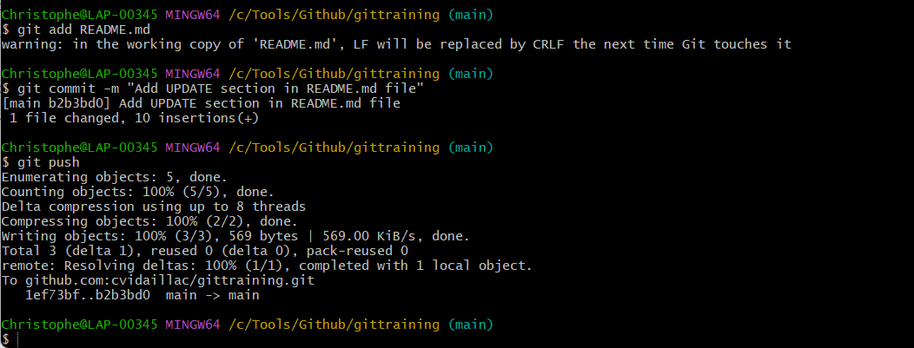
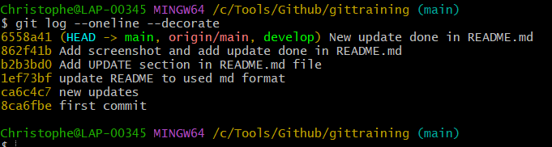
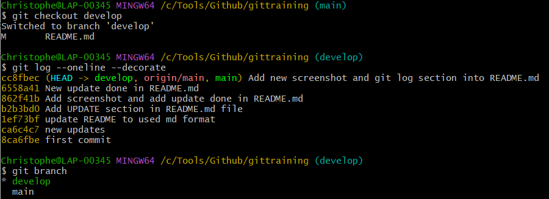
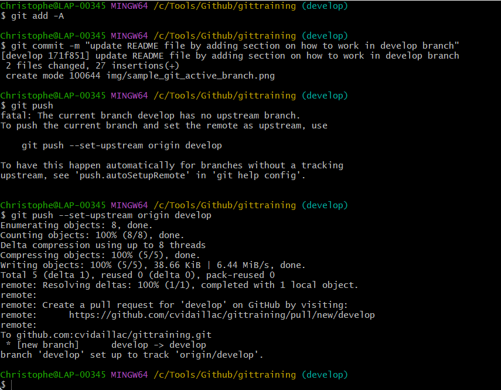
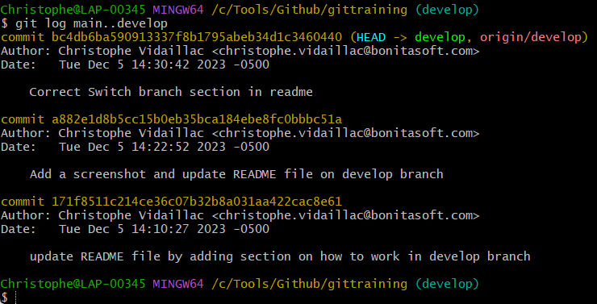
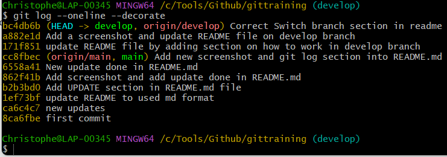
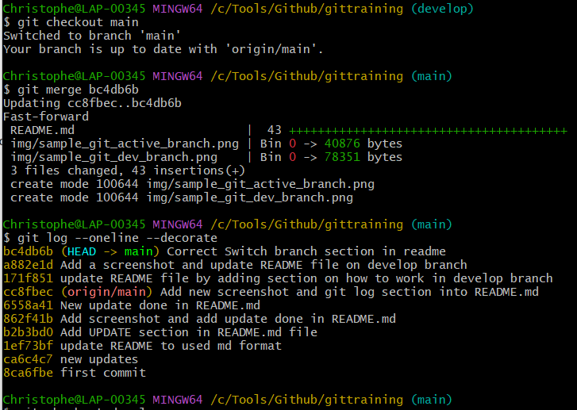
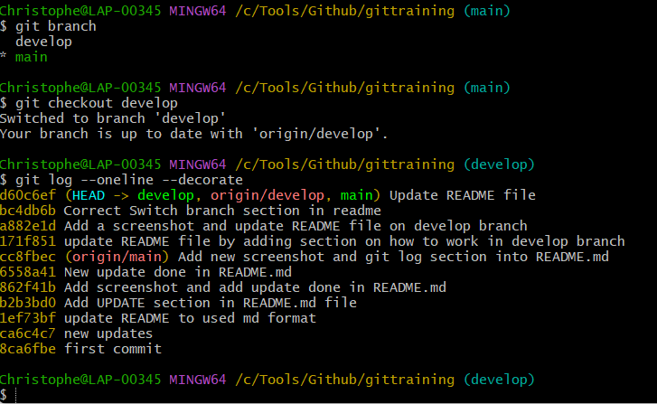

# gittraining

> This is a step by step list of git commands to create and to update repository based on several cases.

## TO CREATE A NEW REPOSITORY ON THE COMMAND LINE

> List of git commands to create a new repository from your git terminal:

-   echo "# gittraining" >> README.md          <===  Create a README.md file with a content   (locally)
-   git init                                   <===  Create a new Git repository (locally)
-   git add README.md          		     <===  Add a change in the working directory to the staging area  (locally)
-   git commit -m "first commit"               <===  Capture a snapshot of the project's currently staged changes  (locally)
-   git branch -M main         		     <===  Force to rename the current branch to "main"   (locally)
-   git remote add origin git@github.com:cvidaillac/gittraining.git          <===  Add a new remote repository defined with origin (locally)
-   git push -u origin main         	     <===  Push local code to the master branch of remote repository defined with origin (sent to Github)
  
  
## TO UPDATE YOUR REPOSITORY WITH NEW VERSION OF README.md file updated locally

> Here, we will update the README.md on our local repository and then push the new version to remote repo

-   Do an update into README.md file with your prefered text editor.
-   git add README.md             <===  Add a change in the working directory to the staging area  (locally)
-   git commit -m "new update in README.md to be formatted as .md file"               <===  Capture a snapshot of the project's currently staged changes  (locally)
-   git push          	          <===  Push local code to the master branch of remote repository defined with origin (sent to Github) 

### Screenshots

## HOW TO MANAGE BRANCHES

> Here it's to manage branches: view branches, create and see what's done in a branch

###  CREATE A NEW BRANCH

-   git branch develop           <===    Create a new branch pointing on latest commit done on current branch (here master branch) — it didn’t switch to that branch

###  SHOW WHERE BRANCH POINTERS ARE POINTING

-     git log --oneline --decorate

###   TO REMOVE A BRANCH

> In case you need to remove a branch (locally and remotly)

-   git branch -d develop               <===   Delete branch locally
-   git push origin --delete develop    <===   Delete branch delete branch remotely

###   LET'S CREATE A NEW BRANCH BASED ON MASTER AND UPDATE PROJECT INTO THIS NEW BRANCH

> Here we will switch the develop branch to update project.

##   SWITCH TO DEVELOP BRANCH

> As we deleted the develop branch, we need to create again with following command.
-   git branch develop            <===   Switch to develop branch

> To switch to develop branch:

-   git checkout develop

## Validate which branch I'm working on

-   git log --oneline --decorate

> Or to get more details, we can use the git log command:

-   git log --oneline --decorate

##   UPDATE README.md FILE AND PUSH TO DEVELOP BRANCH

-    git add -A         <===   Add ALL changes done in the working directory to the staging area  (locally)

> As the current branch develop has no upstream branch, we need to setup it and push to remote in develop branch:

-    git push --set-upstream origin develop           <===    Push the current branch and set the remote as upstream

###   MERGE ALL DEV DONE IN DEVELOP BRANCH TO MASTER BRANCH

##   FIRST CHECK DIFFERENCES

>  Here we will check differences between 2 branches

-    git log main..develop         <===   Compare main branch with develop branch

In above example, we have 3 commits ahead in develop branch from main branch. That can be seen in more details with following "git log" command as well:

-    git log --oneline --decorate

## GO TO MERGE ALL DEV DONE IN DEVELOP BRANCH TO MASTER BRANCH

> Here we will merge all dev done in develop branch, referenced by "bc4db6b", to main branch.

First we need to switch to main branch:

-    git chekout master

Second, launch the merge command by referencing the end point of the develop branch we want to merge => "bc4db6b"

-    git merge bc4db6b

Then, check the status of 2 branches:

-    git checkout develop               <===   Switch back to develop branch
-    git log --oneline --decorate       <===   Then check with git log command

